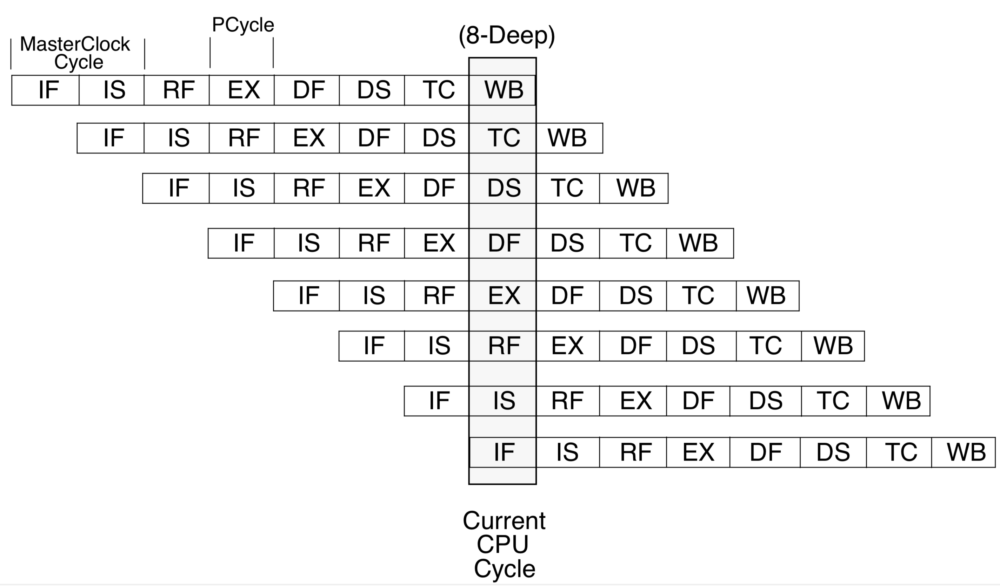

# Assignment: A Three-Pipe Problem

## Table of Contents

* [Introduction](#introduction)
* [Tasks](#tasks)
  * [Task 1: Point and click](#task-1-point-and-click)
  * [Task 2: Forwarding for fun and profit](#task-2-forwarding-for-fun-and-profit)
  * [Task 3: A sanity check](#task-3-a-sanity-check)
  * [Task 4: More stages\!](#task-4-more-stages)
  * [Task 5: A wimpy kind of out\-of\-order execution](#task-5-a-wimpy-kind-of-out-of-order-execution)
* [Deliverables](#deliverables)

## Introduction

In this assignment you will modify a performance simulator to model two simulator variants: a basic five-stage pipeline and a more sophisticated eight-stage variant with variable instruction latencies. The simulator will measure the effect of forwarding on average cycles per instruction (CPI).

## Tasks

### Task 1: Point and click

The file `sim-scalar-5.c` is a cycle-accurate simulation of a basic five-stage pipeline that prevents RAW hazards by stalling instructions in the IF/ID pipeline register until the register file has been written by the instruction causing the RAW hazard; the register file allows forwarding of writes to reads in the same cycle.

Evaluate the performance of this simulator by measuring the average CPI on the four benchmarks provided, and modify `results.csv` to record `task1_CPI`.

### Task 2: Forwarding for fun and profit

Modify the simulator (`sim-scalar-5.c`) to measure the CPI assuming the hardware has support for **all forwarding paths** that can eliminate or reduce stalling due to RAW hazards. For any remaining unavoidable RAW hazards, model hardware that stalls instructions in the IF/ID pipeline register. You must determine when forwarding cannot eliminate the need for stall cycles (perhaps by using pipeline timing diagrams as we have done in class).

Note that multiply and divide instructions use their own registers (`LO` and `HI`) to store results rather than `R1`...`R31`; these can be moved to the GPRs using the `mflo`, `mtlo`, `mfhi`, and `mthi` instructions. Make sure you handle this correctly in your code.

Note that the baseline simulator models all branches and jumps as being resolved in decode and models control hazards due to branches by predicting branches and jumps as not taken. Make sure that your modification maintains this behaviour. In particular, be sure to consider potential unavoidable stall conditions related to branches and jumps reading a register written by earlier instructions (i.e., branches and jumps may need a value forwarded from EX/MEM or MEM/WB).

Evaluate the performance of this simulator by measuring the average CPI on the four benchmarks provided, and record `task2_CPI_stall` and `task2_CPI_fw` in `results.csv` for the baseline five-stage and forwarding implementations respectively. Also record the speedup of the forwarding implementation as `task2_speedup`.

### Task 3: A sanity check

To verify that the results above are reasonable, modify the functional simulator code `sim-safe.c` (from the tutorial). Consider which instructions or instruction sequences cause stalls in the baseline and forwarding pipeline implementations, measure their frequencies, and compute the average CPI you would expect. You should see a difference under 3%.

Evaluate the performance of this simulator by measuring the average CPI on the four benchmarks provided, and record in `task3_CPI_stall` and `task3_CPI_fw` in `results.csv`.

### Task 4: More stages!

In `sim-scalar-8.c`, implement a fully bypassed 8-stage pipeline as shown in the following diagram from the [MIPS R4000 Microprocessor User’s Manual](doc/R4000.pdf):

</img>

The clock cycles we are concerned are PCycles, so the pipeline has 8 stages. In the actual R4000, the master Clock was double-pumped to obtain PClock, and the Manual uses both; just remember that we only care about PClock, which is twice as fast as Clock.

The pipeline stages are described in Sections 3.1 and 3.2 of the processor manual. We do not directly simulate a TLB, but the memory instructions are still split into the DF, DS, and TC stages.

Unlike the real MIPS R4000 (sec. 3.3 of the manual), assume that our branches are resolved **at the end of decode** (RF), and we **do not have branch delay slots**. You do, however, have to be careful to update the control stalls to account for the longer pipeline.

Similarly, assume that a value loaded from memory is available **at the end of the TC stage**. (This is different from the R4000, where you could forward after the DS stage, but it saves you from implementing the gnarly pipeline back-up and restart procedure shown on page 54 of the processor manual).

Evaluate the performance of this simulator by measuring the average CPI on the four benchmarks provided, and record these in `task4_CPI` in `results.csv`. Is this better or worse than the 5-stage? Now assume that the 8-stage pipeline can be clocked twice as fast as the 5-stage pipeline; now, what is the speedup over the 5-stage fully-bypassed pipeline? Record the speedup of the fully forwarded 8-stage running at twice the frequency versus the fully forwarded 5-stage as `task4_speedup`. Does the speedup correspond to the 2× frequency improvement? If not, why not?

The `sim-scalar-8.c` as distributed is the same as `sim-scalar-5.c`. It's your job to change the data structures and code to implement an 8-stage pipeline.

### Task 5: A wimpy kind of out-of-order execution

In `sim-scalar-8m.c`, implement a fully bypassed 8-stage pipeline as above with a separate functional unit for an integer multiplier/divider.

In our implementation, this unit is **not pipelined**, and can only execute only instruction at a time. However, _other_ CPU instructions can keep executing at the same time provided they are not trying access the multiply/divide unit or the special `HI` and `LO` registers that multiply and divide instructions write to. Instructions trying to read these will stall in the decode (RF) stage — these protections are known as interlocks, and are really a very simple kind of scoreboard. (In fact, executing multiply and divide operations like this is a very simple form of out-of-order execution — you might want to try to think of a way in which a programmer could trick the CPU into exposing that it is in fact doing things out of order.)

The various multiply and divide instructions need more cycles than instructions that do not use the multiply/divide unit. The cycle timings are shown on page 40 of the processor manual.

The `sim-scalar-8m.c` as distributed is the same as `sim-scalar-5.c`. We recommend that you copy over your working solution from `sim-scalar-8.c` and modify it to implement instruction timing and interlocks.

Evaluate the performance of this simulator by measuring the average CPI on the four benchmarks provided and record as `task5_CPI` in `results.csv`. Record the speedup of this implementation over the forwarding implementation from Task 4 as `task5_speedup`. How much performance are you “losing” by implementing a more realistic multiply/divide unit?

## Deliverables

### Task 1 [1 mark]

- modified `results.csv`

### Task 2 [3 marks]

- modified `sim-scalar-5.c`
- modified `results.csv`

### Task 3 [1 marks]

- modified `sim-safe.c`
- modified `results.csv`

### Task 4 [3 marks]

- modified `sim-scalar-8.c`
- modified `results.csv`

### Task 5 [2 marks]

- modified `sim-scalar-8m.c`
- modified `results.csv`
